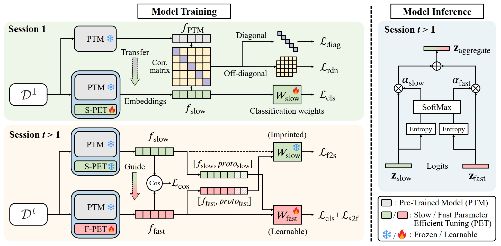

# [NeurIPS2024] SAFE: Slow and Fast Parameter-Efficient Tuning for Continual Learning with Pre-Trained Models


## Requirements
- [PyTorch >= version 1.4](https://pytorch.org)
- tqdm == 4.65.0
- timm == 0.6.5

## Datasets
We follow [RanPAC](https://github.com/RanPAC/RanPAC) setting to use the same data index_list for training. 

## Running scripts

    $ python main.py -d cifar224


- for -d choose from 'cifar224', 'imageneta'


## Acknowledgment
Our project references the codes in the following repos.

- [RanPAC](https://github.com/RanPAC/RanPAC)
- [VPT](https://github.com/sagizty/VPT)
- [AdaptFormer](https://github.com/ShoufaChen/AdaptFormer)
- [SSF](https://github.com/dongzelian/SSF)

## Citation
If you find our work useful in your research, please consider citing:
```
@inproceedings{zhao2024safe,
  title={SAFE: Slow and Fast Parameter-Efficient Tuning for Continual Learning with Pre-Trained Models},
  author={Zhao, Linglan and Zhang, Xuerui and Yan, Ke and Ding, Shouhong and Huang, Weiran},
  booktitle={Advances in Neural Information Processing Systems (NeurIPS)},
  year={2024}
}
```
